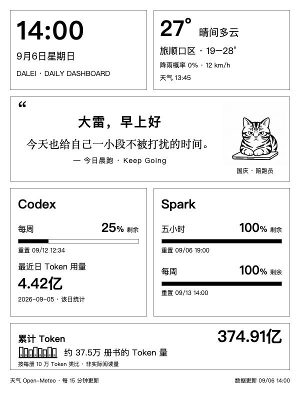
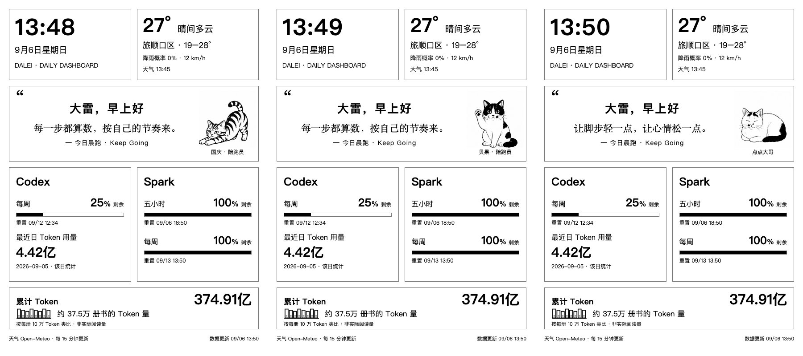
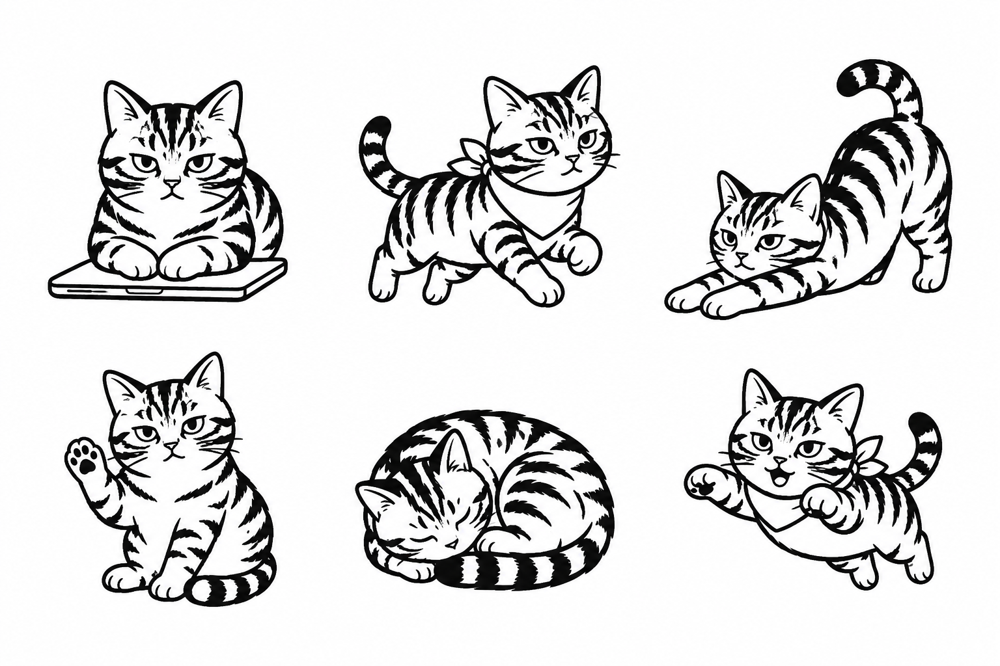
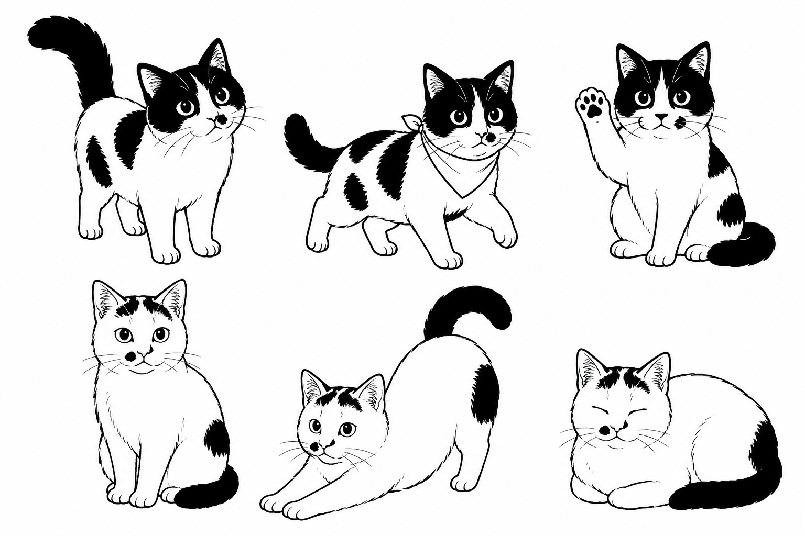
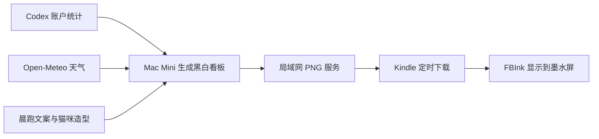

# 大雷的 Kindle 小窗口

### 看天气，看看猫，再看看今天用了多少 AI。

一台旧 Kindle，一句晨跑鼓励，三位熟悉的陪伴。

**旅顺口天气 · 晨跑文案 · 国庆 / 贝果 / 点点大哥 · Codex 用量**

[看板截图](#一眼看见今天) · [三只猫](#这块屏幕里住着三只猫) · [项目来源](#从哪里来)

---

我有一台 Kindle 第八代。让它重新回到桌面，想做的事情很简单：抬头时，看一眼旅顺口的天气，读一句晨跑鼓励，顺便知道 Codex 还剩多少额度。

后来，国庆也来了。再后来，贝果和点点大哥也有了各自的位置。

于是，这块屏幕有了自己的样子。

## 一眼看见今天

> 上图为实际运行程序生成的 **600 × 800 PNG**，不是设备实拍，也不是概念稿。截图中的天气和用量是抓取时的快照，不代表此刻的数据。

| 一块区域 | 放什么 | 怎么变化 |
| --- | --- | --- |
| 左上角 | 时间、日期、星期 | 随看板刷新 |
| 右上角 | 旅顺口区天气、温度范围、降雨概率、风速 | 天气每 15 分钟获取一次 |
| 中间 | 「大雷，早上好」和晨跑鼓励 | 每 5 分钟轮换一句 |
| 文案右侧 | 三只猫的专属黑白造型 | 每分钟轮换，下一次出场更换动作 |
| 下方两张卡片 | Codex 每周余额、最近日 Token、Spark 额度 | 约每分钟更新 |
| 最下方 | 累计 Token 与书本数量类比 | 随账户统计更新 |

### 数字也可以说人话

`37,491,000,000` 很难一眼读懂。看板会把这类数字写成 **374.91 亿 Token**，再配一排小书架：

> 如果每册书按 10 万 Token 计算，这个数量大约相当于 37.5 万册书的 Token 量。

这是帮助理解规模的**假设换算**，并不表示实际读过或写过这些书，也不代表独立内容量。

## 这块屏幕里住着三只猫

它们的造型参考了自家猫咪的照片，用 AI 辅助绘制，再适配为墨水屏上的黑白图案。

| 国庆 | 贝果 | 点点大哥 |
| --- | --- | --- |
| 虎斑纹、额头的花纹、半眯着的眼睛 | 黑白花纹、脸上的白线、竖起的大尾巴 | 白脸、鼻子旁的小黑点、稳稳坐着的神态 |
| 趴电脑、慢跑、伸懒腰、招手、睡觉、小跳跃 | 抬头、慢跑、招手 | 端坐、伸懒腰、趴着休息 |

**国庆 → 贝果 → 点点大哥 → 国庆……**

点点大哥走丢了，也给他留了一个位置。

*上图把三个轮换时刻并排展示；Kindle 上每次显示一位。三个画面共用一次抓取的数据，用于查看造型和布局。*

展开看三只猫的完整造型

#### 国庆的六个动作

#### 贝果与点点大哥

上排是贝果，下排是点点大哥。

## 让墨水屏按自己的节奏工作

看板以黑白、细边框和大字为主。猫咪的“动作”通过一帧一帧的轮换呈现，不是高帧率视频；保留定期全屏刷新，减少残影。

晨跑文案也尽量轻一点：

> 今天的目标很简单：舒服地开始，轻松地回来。

不编造打卡成绩，不催着追配速。抬头看见时，能让人想给自己留一点时间就好。

## 怎么跑起来的

本地使用 Kindle 第八代（KT3）、600 × 800 看板、Mac Mini、Node.js 和 Chrome 无界面截图。Mac 通过 LaunchAgent 在用户登录后启动服务；Kindle 使用脚本拉取图片，支持配置 Upstart 启动任务。

**当前仓库是项目展示与来源记录页，尚未同步本地改造源码。** 需要研究基础实现，可以从下方的来源项目开始。越狱方法取决于具体型号和固件，请查阅 [KindleModding](https://kindlemodding.org/) 的当前指南。

### 数据该怎么读

- Codex 和 Spark 的额度分别展示，不混用。
- 主账户未返回五小时窗口时，不推算余额；这个位置显示**最近有记录的一天**的 Token 用量，并标明日期。
- 最近日用量不一定是今天的数据，累计 Token 也不等于剩余额度。
- 获取失败时标注旧数据或不可用，不把缺失数据当成 0。
- 本地实现完成了 37 项自动化测试，覆盖额度、天气、轮换与数据换算等逻辑；这不等于所有 Kindle 型号都已验证。

## 从哪里来

感谢 **Alex Ishida** 的 [alexishida/kindle-dashboard](https://github.com/alexishida/kindle-dashboard)：它提供了采集 AI 用量、生成 PNG、通过局域网在 Kindle 上显示的基础实现。

本地改造从我的分支 [paul010/kindle-dashboard](https://github.com/paul010/kindle-dashboard) 开始，基线为 `bd56293`（v1.0.7）。这个展示项目记录了在其基础上增加的：

- Mac Mini 常驻运行与登录自启配置。
- 面向第八代 Kindle 的 600 × 800 中文卡片布局。
- 旅顺口区天气与定时轮换的晨跑文案。
- 国庆、贝果、点点大哥的专属造型和轮换。
- Codex / Spark 分组、带日期的最近日用量，以及累计 Token 的书本类比。

天气来自 [Open-Meteo](https://open-meteo.com/)，显示由 [FBInk](https://github.com/NiLuJe/FBInk) 支持，设备准备参考 [KindleModding](https://kindlemodding.org/)。

本仓库不替上游代码声明新的许可证。代码、工具与素材的使用条件请分别查看各来源；猫咪造型以大雷提供的照片为参考，使用 AI 辅助生成。

---

**大雷，早上好。**

屏幕里的数字会变，三只猫轮流陪你。

