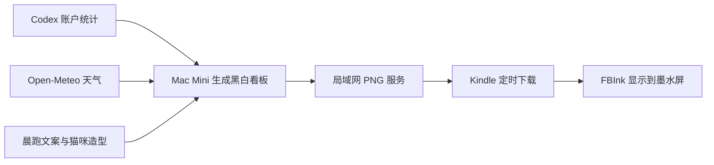

<div align="center">

# 大雷的 Kindle 小窗口

### 看天气，看看猫，再看看今天用了多少 AI。

一台旧 Kindle，一句晨跑鼓励，三位熟悉的陪伴。

**旅顺口天气 · 晨跑文案 · 国庆 / 贝果 / 点点大哥 · Codex 用量**

[安装运行](#安装与运行) · [看板截图](#一眼看见今天) · [三只猫](#这块屏幕里住着三只猫) · [项目来源](#从哪里来)

</div>

---

我有一台 Kindle 第八代。让它重新回到桌面，想做的事情很简单：抬头时，看一眼旅顺口的天气，读一句晨跑鼓励，顺便知道 Codex 还剩多少额度。

后来，国庆也来了。再后来，贝果和点点大哥也有了各自的位置。

于是，这块屏幕有了自己的样子。

## 已经回到桌面上了

<div align="center">

</div>

**2026 年 9 月 6 日，Kindle 第八代实机效果。** 国庆趴在文案右边，下面是 Codex 与 Spark 的额度，以及累计 Token 的书本类比。这张照片记录了看板在墨水屏上的实际显示；重启自启效果尚未通过本图验证。

### 贝果也来值班了

<div align="center">

</div>

同一天的另一张实拍：看板时间从上一张的 **14:00** 到这一张的 **14:01**，右侧从国庆换成了贝果。两张照片记录了不同轮换帧在真实墨水屏上的显示。

## 一眼看见今天

<div align="center">

</div>

> 上图为实际运行程序生成的 **600 × 800 PNG**，不是设备实拍，也不是概念稿。截图中的天气和用量是抓取时的快照，不代表此刻的数据。

| 一块区域 | 放什么 | 怎么变化 |
| --- | --- | --- |
| 左上角 | 时间、日期、星期 | 随看板刷新 |
| 右上角 | 旅顺口区天气、温度范围、降雨概率、风速 | 天气每 15 分钟获取一次 |
| 中间 | 「大雷，早上好」和晨跑鼓励 | 每 5 分钟轮换一句 |
| 文案右侧 | 三只猫的专属黑白造型 | 每分钟轮换，下一次出场更换动作 |
| 下方两张卡片 | Codex 每周余额、最近日 Token、Spark 额度 | 约每分钟更新 |
| 最下方 | 累计 Token 与书本数量类比 | 随账户统计更新 |

### 数字也可以说人话

`37,491,000,000` 很难一眼读懂。看板会把这类数字写成 **374.91 亿 Token**，再配一排小书架：

> 如果每册书按 10 万 Token 计算，这个数量大约相当于 37.5 万册书的 Token 量。

这是帮助理解规模的**假设换算**，并不表示实际读过或写过这些书，也不代表独立内容量。

## 这块屏幕里住着三只猫

它们的造型参考了自家猫咪的照片，用 AI 辅助绘制，再适配为墨水屏上的黑白图案。

| 国庆 | 贝果 | 点点大哥 |
| --- | --- | --- |
| 虎斑纹、额头的花纹、半眯着的眼睛 | 黑白花纹、脸上的白线、竖起的大尾巴 | 白脸、鼻子旁的小黑点、稳稳坐着的神态 |
| 趴电脑、慢跑、伸懒腰、招手、睡觉、小跳跃 | 抬头、慢跑、招手 | 端坐、伸懒腰、趴着休息 |

**国庆 → 贝果 → 点点大哥 → 国庆……**

点点大哥走丢了，也给他留了一个位置。


*上图把三个轮换时刻并排展示；Kindle 上每次显示一位。三个画面共用一次抓取的数据，用于查看造型和布局。*

<details>
<summary>展开看三只猫的完整造型</summary>

#### 国庆的六个动作


#### 贝果与点点大哥

上排是贝果，下排是点点大哥。


</details>

## 让墨水屏按自己的节奏工作

看板以黑白、细边框和大字为主。猫咪的“动作”通过一帧一帧的轮换呈现，不是高帧率视频；保留定期全屏刷新，减少残影。

晨跑文案也尽量轻一点：

> 今天的目标很简单：舒服地开始，轻松地回来。

不编造打卡成绩，不催着追配速。抬头看见时，能让人想给自己留一点时间就好。

## 怎么跑起来的



本地使用 Kindle 第八代（KT3）、600 × 800 看板、Mac Mini、Node.js 和 Chrome 无界面截图。Mac 通过 LaunchAgent 在用户登录后启动服务；Kindle 使用脚本拉取图片，支持配置 Upstart 启动任务。

**当前仓库已包含本地改造源码。** Mac Mini 运行步骤见 [运行指南](docs/SETUP.md)，基础实现与致谢见下方来源项目。越狱方法取决于具体型号和固件，请查阅 [KindleModding](https://kindlemodding.org/) 的当前指南。

### 数据该怎么读

- Codex 和 Spark 的额度分别展示，不混用。
- 主账户未返回五小时窗口时，不推算余额；这个位置显示**最近有记录的一天**的 Token 用量，并标明日期。
- 最近日用量不一定是今天的数据，累计 Token 也不等于剩余额度。
- 获取失败时标注旧数据或不可用，不把缺失数据当成 0。
- 本地实现完成了 37 项自动化测试，覆盖额度、天气、轮换与数据换算等逻辑；这不等于所有 Kindle 型号都已验证。

## 安装与运行

以下步骤用于 **Mac 独立看板模式**。需要 Node.js 24+、Google Chrome，以及已安装并登录的 Codex CLI。Kindle 端需要提前准备好适配型号和固件的环境及 FBInk。

### 1. 下载代码并安装依赖

```sh
git clone https://github.com/paul010/kindledalei2025.git
cd kindledalei2025
npm ci --ignore-scripts --omit=dev
mkdir -p out
```

### 2. 设置天气城市

创建本地文件 `out/weather-location.json`。下面以北京城市中心为例，修改城市名称和经纬度即可：

```sh
cat > out/weather-location.json <<'EOF'
{"name":"北京","latitude":39.90,"longitude":116.40}
EOF
```

使用城市中心坐标即可，无需填写家庭精确位置。该文件位于忽略目录中，不会随代码提交。

### 3. 启动看板

```sh
DASH_PROFILE=codex DASH_WIDTH=600 DASH_HEIGHT=800 RENDER_INTERVAL=60 npm run supervisor
```

首次生成稍等片刻，然后打开 [本机看板](http://localhost:8787/dash.png)。默认每分钟生成一次 600 × 800 图片；终端按 `Ctrl+C` 停止服务。

如果找不到 Codex 或 Chrome，可通过 `CODEX_BIN`、`CHROME` 环境变量指定其可执行文件的绝对路径。Codex 使用本机登录状态，请勿把登录凭据复制进项目。

### 4. 让 Kindle 显示图片

让 Mac 和 Kindle 连接到相互可访问的局域网。通过 USB 将 `kindle/dash-loop.sh` 复制到 Kindle 根目录，再在 Kindle 的终端或脚本启动器中运行：

```sh
PC='http://<MAC_LAN_IP>:8787/dash.png' INTERVAL=60 FULL_EVERY=10 sh /mnt/us/dash-loop.sh
```

将 `<MAC_LAN_IP>` 替换为自己 Mac 的局域网地址。命令在 **Kindle 上**执行；Mac 上的看板服务需保持运行。不同屏幕尺寸需要相应调整渲染参数与布局。

服务用于可信局域网，图片包含账户用量，不要将端口映射到公网。代码不包含越狱包；设备准备请参考 [KindleModding](https://kindlemodding.org/)。

### 自启、修改与验证

Mac 登录后自启可配置 LaunchAgent；Kindle 的自启脚本及安装工具在 `kindle/` 和 `scripts/kindle-autostart.js`。详细步骤和验证限制见 [运行指南](docs/SETUP.md) 与 [Kindle 安装文档](KINDLE-INSTALLATION.md)。

晨跑文案与猫咪名称在 `locales/zh-CN.json`，看板布局在 `backend/codex-page.js`，猫咪动作素材在 `render/assets/`。

运行测试：

```sh
npm test
```

上述安装只针对独立看板服务。仓库同时保留上游 Electron 界面；开发该界面需另装开发依赖，macOS 打包安装尚未验证。

## 从哪里来

感谢 **Alex Ishida** 的 [alexishida/kindle-dashboard](https://github.com/alexishida/kindle-dashboard)：它提供了采集 AI 用量、生成 PNG、通过局域网在 Kindle 上显示的基础实现。

本地改造从我的分支 [paul010/kindle-dashboard](https://github.com/paul010/kindle-dashboard) 开始，基线为 `bd56293`（v1.0.7）。这个展示项目记录了在其基础上增加的：

- Mac Mini 常驻运行与登录自启配置。
- 面向第八代 Kindle 的 600 × 800 中文卡片布局。
- 旅顺口区天气与定时轮换的晨跑文案。
- 国庆、贝果、点点大哥的专属造型和轮换。
- Codex / Spark 分组、带日期的最近日用量，以及累计 Token 的书本类比。

天气来自 [Open-Meteo](https://open-meteo.com/)，显示由 [FBInk](https://github.com/NiLuJe/FBInk) 支持，设备准备参考 [KindleModding](https://kindlemodding.org/)。

本仓库不替上游代码声明新的许可证。代码、工具与素材的使用条件请分别查看各来源；猫咪造型以大雷提供的照片为参考，使用 AI 辅助生成。

---

<div align="center">

**大雷，早上好。**

屏幕里的数字会变，三只猫轮流陪你。

</div>
